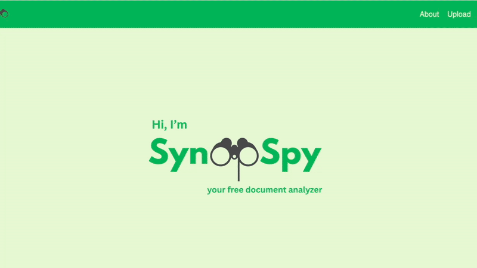

# SynopSpy: Free Document Summarizer with Legal Risk Analysis 
SynopSpy is a full stack web application that help users understand and assess complex
documents. Some examples of documents SynopSpy helps analyze are legal fine print, court documents, or terms and conditions. SynopSpy uses NLP(Natural Language Processing) to summarize and analyze these documents, flag risky language, and assign a document safety rating. 

## Live Application: https://synopspy.onrender.com

## Key Features
- <strong>AI-Powered Summarization and Risk Analysis:</strong> Leverages <strong>Google's Gemini API </strong> to perform complex NLP tasks, including large document summarization and content risk analysis. Detects complex legal language and highlights sections in the document that require increased oversight. 
- <strong>Dynamic Safety Rating:</strong> processes AI output and generates a 1-5 safety score, providing users with a quick understanding of document risk.
- <strong>Upload History:</strong> provides session-based access to a user's previous document uploads, allowing for easy comparison and review. 

## Process 
- Developed a RESTful API with FastAPI, connected to a React frontend via JavaScript. 
- Integrates a React framework with a FastAPI/Python backend
- Involves NLP model integration in the stack to process user upload and analyze data. 

## Technologies 
- <strong>Frontend:</strong> React, Javascript 
- <strong>Backend:</strong> FastAPI, Python
- <strong>API-Communication: </strong>Custom built RESTful API handles all data exchanges between frontend and backend. CORS is used to allow cross-origin requests. 
- <strong>File Processing:</strong> PyMuPDF, python-docx Libraries
- <strong>AI-Model:</strong> Google Gemini 

## ⚠️ Usage Notice
This project was created by me (Aishwarya-ashram15) as a personal project.

All Rights Reserved. 

