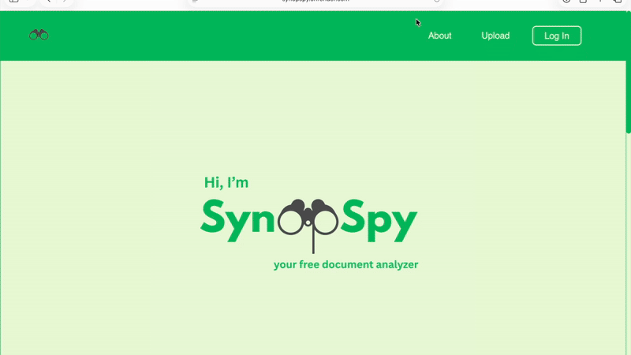

# SynopSpy 
### AI-Powered Document Analyzer & Risk Assessor


### [Click Here to Launch Live App]: https://synopspy.onrender.com
*(Note: App is deployed on Render Free Tier. Please allow ~60-120 seconds for the server to spin up on first load.)*



SynopSpy is a full stack web application that help users understand and assess complex
documents. Some examples of documents SynopSpy helps analyze are legal fine print, court documents, or terms and conditions. SynopSpy uses NLP(Natural Language Processing) to summarize and analyze these documents, flag risky language, and assign a document safety rating.


## Key Features
- <strong>AI-Powered Summarization and Risk Analysis:</strong> Leverages <strong>Google's Gemini API </strong> to perform complex NLP tasks, including large document summarization and content risk analysis. Detects complex legal language and highlights sections in the document that require increased oversight. 
- <strong>Dynamic Safety Rating:</strong> processes AI output and generates a 1-5 safety score, providing users with a quick understanding of document risk.
- <strong>User Authentication</strong>: Integrates a secure login using <strong>Auth0</strong> to ensure that document uploads are tied to individual users. 
- <strong>Upload History:</strong> Stores and retrieves a user's previous document analysis using <strong>MongoDB</strong>, allowing for easy comparison and review. 

## Process 
- Developed a RESTful API with FastAPI, connected to a React frontend via JavaScript. 
- User authentication handled via Auth0
- Uploaded documents are processed using PyMuPDF and python-docx, analyzed with Google Gemeni API. 
- MongoDB stores user-specific upload history

## Technologies 
* <strong>Backend:</strong> FastAPI, Python
* <strong>Frontend:</strong> React, Javascript 
* <strong>Database:</strong> MongoDB | NoSQL storage for user upload history and analysis
* <strong>Security:</strong> Auth0 | Secure user session management
* <strong>Deployment:</strong> Render (PaaS) | Automated build and deployment pipeline 
* <strong>API-Communication: </strong>Custom built RESTful API handles all data exchanges between frontend and backend. CORS is used to allow cross-origin requests. 
* <strong>File Processing:</strong> PyMuPDF, python-docx Libraries
* <strong>AI-Model:</strong> Google Gemini 

## How to Run Locally:   
- To run the program, run both the <strong>React</strong> frontend and the <strong>FastAPI</strong> backend code simultaneously.   
1. Clone the Repo
    ```git clone [https://github.com/ashram15/synopspy.git](https://github.com/ashram15/synopspy.git)```
2. First navigate to the project root    
    ```cd synopspy-project```  
3. Start the frontend    
    ```cd frontend ```  
    ```npm install ```  
    ```npm run dev```  
4. Start the backend on localhost:8000:  
    ```cd backend</code>```  
    - Create and activate venv  
        ```python -m venv .venv```  
        ```source .venv/bin/activate```
    - Install Requirements   
        ```pip install -r requirements.txt```
    - Run Backend:  
        ```uvicorn app:app --reload</code>```  
5. Access the App
    - Go to browser and access frontend through <code>localhost:5173</code>
<strong>The Frontend should now be running on <code>localhost:5173</code> and the backend on <code>localhost:8000</code></strong> 


