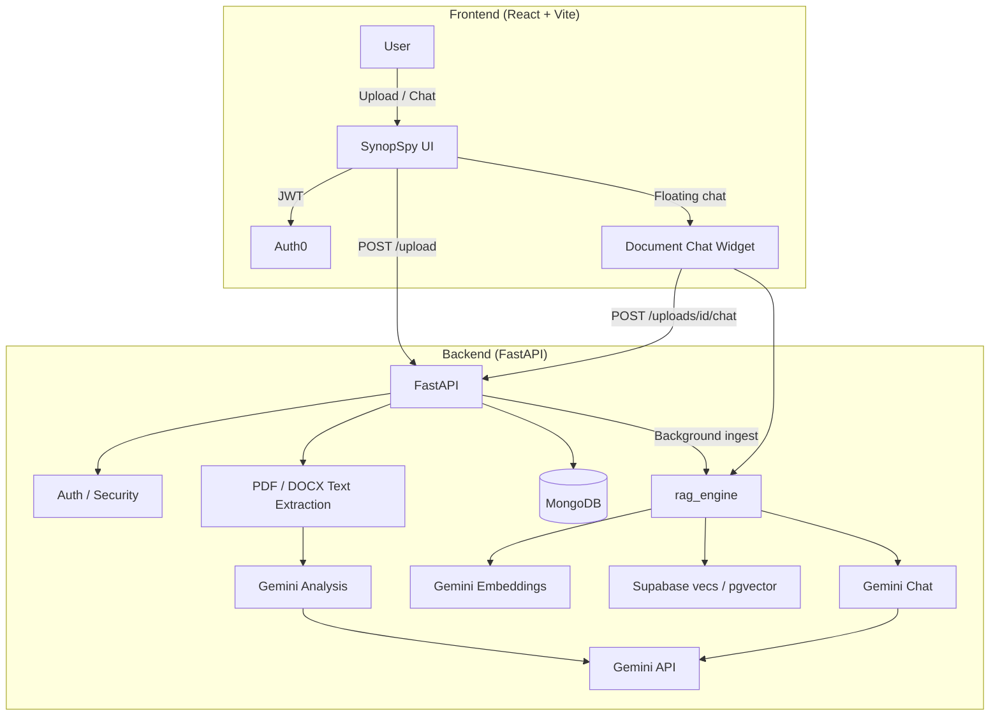

# SynopSpy 
### AI-Powered Document Analyzer & Risk Assessor


### [Click Here to Launch Live App](https://synopspy.onrender.com)
*(Note: App is deployed on Render Free Tier. Please allow ~60–120 seconds for the server to spin up on first load.)*

https://github.com/user-attachments/assets/053fed21-967a-41af-8e42-444c72244f7e


SynopSpy is a full-stack web application that helps users understand and assess complex documents—legal fine print, contracts, terms and conditions, training materials, and more. It uses **Google Gemini** for upload-time analysis (summaries, risk ratings, flagged language) and a **RAG-powered document chatbot** so authenticated users can ask grounded questions about each uploaded file.

---

## Key Features

- **AI-Powered Summarization and Risk Analysis:** Uses **Google Gemini** for NLP tasks including summarization and content risk analysis. Flags complex or concerning language.
- **Dynamic Safety Rating:** Generates a 1–5 safety score so users can quickly gauge document risk.
- **Document Chatbot (RAG):** Floating chat widget on the analysis view. Ask questions about the **current upload only**; answers are grounded in retrieved document chunks (not general web knowledge).
- **User Authentication:** **Auth0** ties uploads and chat to individual users.
- **Upload History:** **MongoDB** stores past analyses for review and re-opening.
- **Analysis PDF Download:** Authenticated users can download their analysis report.

---

## Document Chatbot & RAG Pipeline

The chatbot is **not** a generic ChatGPT wrapper. Each conversation is scoped to a single `upload_id` using vector search + metadata filters.

### How it works

1. **Upload (authenticated):** After analysis, the backend extracts text (PDF via PyMuPDF, DOCX via python-docx) and runs **background ingestion**.
2. **Chunking:** Sliding-window chunks (~1000 characters, ~150 overlap) on word boundaries (`rag_engine.chunk_document`).
3. **Embeddings:** **Gemini** `gemini-embedding-001` (768 dimensions) via the official `google-genai` SDK.
4. **Vector store:** Chunks are upserted into Supabase **pgvector** using the official **`vecs`** client (`contract_documents` collection).
5. **Chat:** User question → query embedding → cosine search with `document_id` filter → top-k chunks → **Gemini** `gemini-2.5-flash` answers using **only** retrieved context. If the answer is not in the document, the model responds: *"I cannot find this in the document."*

### Design choices

| Choice | Rationale |
|--------|-----------|
| **Gemini only** (no OpenAI) | Same API key as analysis; free tier friendly |
| **vecs + Postgres** | Native Supabase vector store; no LangChain/LlamaIndex |
| **Per-document isolation** | `filters={"document_id": {"$eq": upload_id}}` on every query |
| **Floating UI** | Chat button bottom-right; analysis stays a two-column layout |

### Backend modules

| File | Role |
|------|------|
| `backend/services/rag_engine.py` | Chunking, embed, upsert, query, Gemini chat |
| `backend/services/rag_service.py` | FastAPI-facing ingest / Q&A wrappers |
| `frontend/src/DocumentChatWidget.jsx` | Floating chat FAB + panel |

### API endpoints

| Method | Path | Description |
|--------|------|-------------|
| `POST` | `/upload` | Analyze file; triggers RAG ingest when authenticated + `RAG_ENABLED=true` |
| `POST` | `/uploads/{upload_id}/chat` | Body: `{ "question": "..." }` — document-scoped RAG answer |
| `GET` | `/uploads` | List user's past uploads |
| `GET` | `/analysis/{upload_id}/pdf` | Download analysis PDF |

---

## System Architecture  



---

## Technologies 

| Layer | Stack |
|-------|--------|
| **Backend** | FastAPI, Python 3.10+ |
| **Frontend** | React 19, Vite, MUI |
| **Analysis storage** | MongoDB |
| **Vector store** | Supabase Postgres + **pgvector** via **`vecs`** |
| **AI** | Google Gemini (`gemini-2.5-flash`, `gemini-embedding-001`) |
| **Auth** | Auth0 |
| **File parsing** | PyMuPDF, python-docx |
| **Deployment** | Render, Docker |

---

## Environment Variables

Copy `backend/.env.example` to `backend/.env`.

### Core (required)

```env
MONGO_URI=
DB_NAME=synopspyDB
GEMINI_API_KEY=
AUTH_0_DOMAIN=
AUTH_0_AUDIENCE=
FRONTEND_URL=http://localhost:5173
```

### RAG / Supabase (required for chat)

```env
RAG_ENABLED=true
SUPABASE_URL=https://<project-ref>.supabase.co
SUPABASE_SERVICE_ROLE_KEY=
# Direct Postgres URL for vecs (Dashboard → Settings → Database)
# URL-encode special characters in the password (@ → %40, % → %25, etc.)
SUPABASE_DB_CONNECTION_STRING=postgresql://postgres.<ref>:<password>@<host>:6543/postgres

EMBEDDING_MODEL=gemini-embedding-001
EMBEDDING_DIMENSION=768
CHAT_MODEL=gemini-2.5-flash
RAG_COLLECTION_NAME=contract_documents
RAG_TOP_K=8
CHUNK_SIZE=1000
CHUNK_OVERLAP=150
```

**Notes:**

- Set `RAG_ENABLED=false` to disable chat (returns `503` on `/chat`).
- After changing embedding model or dimension, **re-upload** documents so vectors are re-ingested.
- The `vecs` collection dimension must match `EMBEDDING_DIMENSION` (default **768**).

### Frontend

```env
VITE_BACKEND_URL=http://localhost:8000
```

(Auth0 settings in your existing frontend env as configured.)

---

## How to Run Locally

Run the **React** frontend and **FastAPI** backend together.

1. **Clone the repo**
   ```bash
   git clone https://github.com/ashram15/synopspy.git
   cd synopspy-project
   ```

2. **Backend** (`localhost:8000`)
   ```bash
   cd backend
   python -m venv .venv
   source .venv/bin/activate   # Windows: .venv\Scripts\activate
   pip install -r requirements.txt
   cp .env.example .env        # fill in keys (see above)
   uvicorn app:app --reload --port 8000
   ```

3. **Frontend** (`localhost:5173`)
   ```bash
   cd frontend
   npm install
   npm run dev
   ```

4. Open **http://localhost:5173**, sign in, upload a document, then use the **chat button** (bottom-right) on the results screen.

---

## Testing & Quality Assurance

Backend tests use **Pytest** and **FastAPI TestClient**.

```bash
cd backend
source .venv/bin/activate
PYTHONPATH=. pytest
```

**Coverage includes:**

- API route / feature-flag behavior (`RAG_ENABLED`)
- RAG chunking (`tests/test_rag_engine.py`)
- Query expansion helpers (`tests/test_rag_query_expand.py`)

---

## Validating the Chatbot

Suggested checks after enabling RAG:

1. **In-document:** “What is this document about?” / “Who are the parties?”
2. **Specific:** “What does Module 2 include?” (for slides with `MODULE 02` headings)
3. **Hallucination:** Ask about something **not** in the file → expect *I cannot find this in the document.*
4. **Isolation:** Open a different past upload and confirm answers don’t leak from another file.

**Re-upload** after backend/RAG config changes so embeddings stay in sync.

---

## Key Design Decisions

- **FastAPI:** Async-friendly, low boilerplate for file upload + background RAG ingest.
- **MongoDB:** Flexible JSON for analysis blobs and upload history.
- **Gemini:** Single vendor for analysis, embeddings, and chat; generous free tier.
- **vecs (no LangChain):** Direct control over chunking, upsert, and filtered vector query.
- **Raw pythonic RAG:** `rag_engine.py` uses native `google-genai` + `vecs` only.

---

## Future Improvements 

- Email notifications when high-risk documents are detected  
- Collaborative sharing of analyses  
- OCR / vision pass for image-only PDFs on ingest  
- Custom risk keyword lists  
- Stronger mobile polish for the chat widget  
